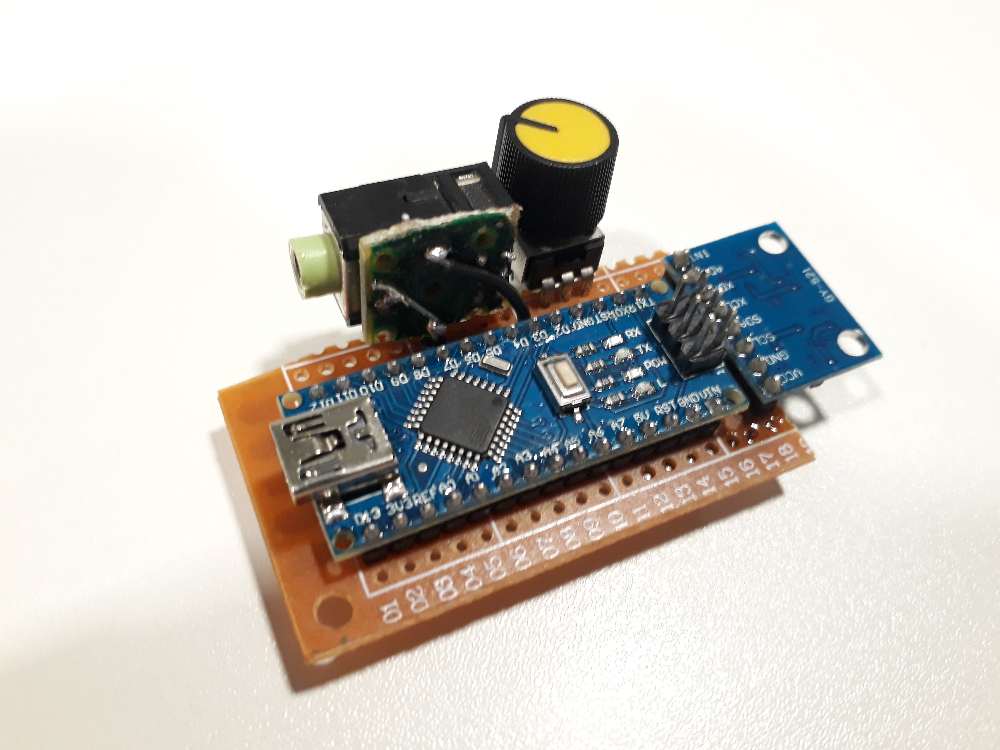
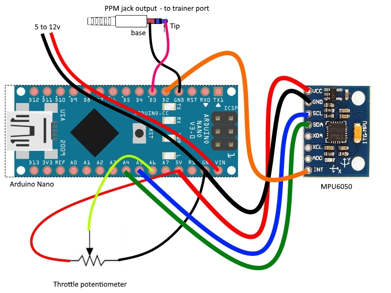

# RC Hand Control System

This code and setup instructions will enable you to very simply contol any RC system by tilting your hand. It is especially adapted for beginners and young people as a more natural way to control a drone or airplane.
It can also help disabled people get back in the air with only one hand or arm.



As you can see, the system can be very compact and easily fitted on top of a hand.

## Getting started

### System components :

* An arduino board (Nano or smaller as to fit on the hand),
* An MPU6050 module (GY-521 for now, working on HMC5883L implementation),
* A potentiometer,
* A jack female plug,
* A jack-to-jack cable,
* A PPM buddyboxing-capable RC transmitter (ex. FrSky),
* An external battery (5 to 20V)

### Prerequisites

You will need to have installed the [Arduino IDE](https://www.arduino.cc/en/main/software) on your computer and setup a buddyboxing model on your RC transmitter set as Master ([here](https://www.youtube.com/watch?v=d2wtD-r6mKo) for FrSky Taranis).

### Connexions and Setup

You will need to connect the hardware as shown below :



[Upload](https://www.arduino.cc/en/Guide/Environment#toc9) the code([hand_control_ppm_mpu6050.ino](hand_control_ppm_mpu6050/hand_control_ppm_mpu6050.ino)) to the Arduino Board, you are ready to go !

## Using and testing the system

### Initial tests

Once the code has been uploaded to the Arduino board, the cable is plugged to both the trainer port of the RC controller and the arduino jack output, power up both the RC transmitter and the Arduino (via USB or Vin), and select your trainer Master model on your RC transmitter (wait about 20 seconds without moving too much for the MPU to initialize).

When in slave input mode, you should see the stick view moving on your screen as follows :
* Roll : tilt your hand left and right
* Pitch : tilt your hand forward and back
* Throttle : rotate the potentiometer
* Yaw : tilt your hand flat to the right or left

The system is working ! Yay !

### Troubleshooting

* If the inputs aren't neutral when the system is flat, [Follow this tutorial](http://42bots.com/tutorials/arduino-script-for-mpu-6050-auto-calibration/) to calibrate the MPU6050 module.
* To modify the angle ranges of the hand, look in the Arduino code for :
```
int const ail_ang = 60; //angle that corresponds to max value (full stick)
int const pit_ang = 60;
int const yaw_ang = 60;
```
Change the '60' (degrees) value to the desired one (they should be integer values).
For example, to decrease range to  -/+ 45 degrees on pitch, the second line becomes :
```
int const pit_ang = 45;
```
* To change channel order (A, E, T, R), look in the Arduino code for :
```
#define AIL_CH 0
#define PIT_CH 1
#define THR_CH 2
#define YAW_CH 3
```
Change the numbers (0, 1, 2, 3) order to the desired one (be sure to put all four numbers to avoid any error).
For example, to switch roll and pitch, it becomes :
```
#define AIL_CH 1
#define PIT_CH 0
#define THR_CH 2
#define YAW_CH 3
```
* To invert channel direction, look in the Arduino code for :
```
int pitch_ppm=map(pitch_deg,-pit_ang,pit_ang,CHANNEL_MIN_VALUE,CHANNEL_MAX_VALUE);
int ail_ppm=map(ail_deg,-ail_ang,ail_ang,CHANNEL_MIN_VALUE,CHANNEL_MAX_VALUE);
int yaw_ppm=map(yaw_deg_diff_constrain,-yaw_ang,yaw_ang,CHANNEL_MIN_VALUE,CHANNEL_MAX_VALUE);
```
Then add or remove a '-' sign (no quote) just after 'map('
For example, to invert roll, the second line becomes :
```
int ail_ppm=map(-ail_deg,-ail_ang,ail_ang,CHANNEL_MIN_VALUE,CHANNEL_MAX_VALUE);
```
For Throttle, just switch the two left and right wires of the potentiometer.
* To change PPM range (in case it doesn't reach full stick), look in the Arduino code for :
```
#define CHANNEL_DEFAULT_VALUE 1500  //set the default servo value
#define CHANNEL_MIN_VALUE 980
#define CHANNEL_MAX_VALUE 2020
```
Change 980 (for min value) and 2020 (for max value) until reaching the desired range.

## Known issues and future developments

* ISSUE : Yaw neutral position drifting : Due to the gyrometer behavior, the neutral position of yaw might drift quite a lot during flight. For now, you can disable the yaw trainer input in the RC model setup. Development is being made to cancel this drift with the use of a magnetometer in parallel. Stay tuned.
* Design of PCB and 3D-printed case to hold the whole system so it can fit on your hand.
* Use of Bluetooth or similar module to avoid using jack cable.

## Contacts and aknowledgements

Please report any issue or improvement ideas on this Git (in the Issue tab).

I would like to thank :
* Jeff Rowberg for his work on the MPU6050
* David Hasko for his work on PPM signal generator.
